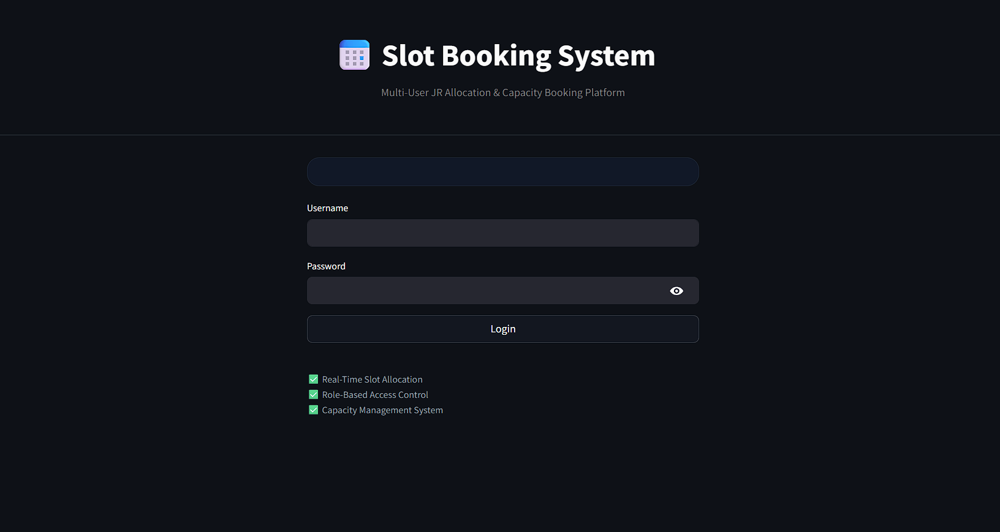
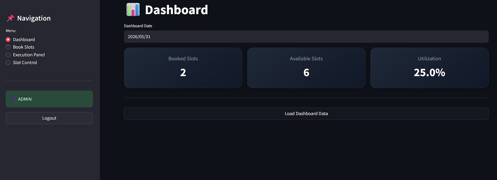
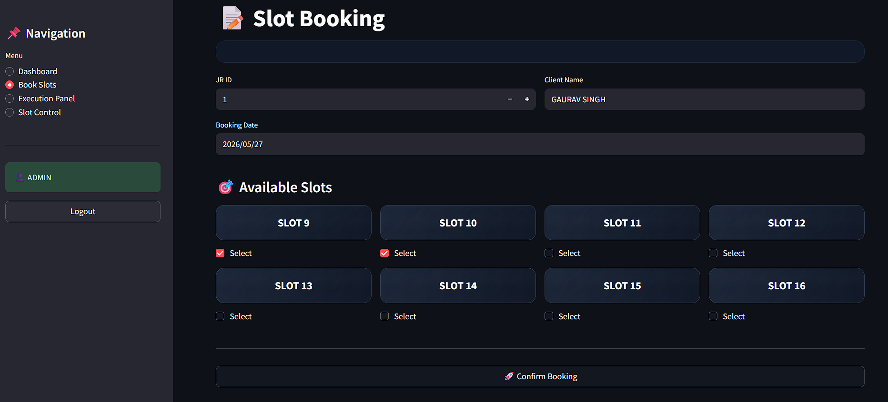
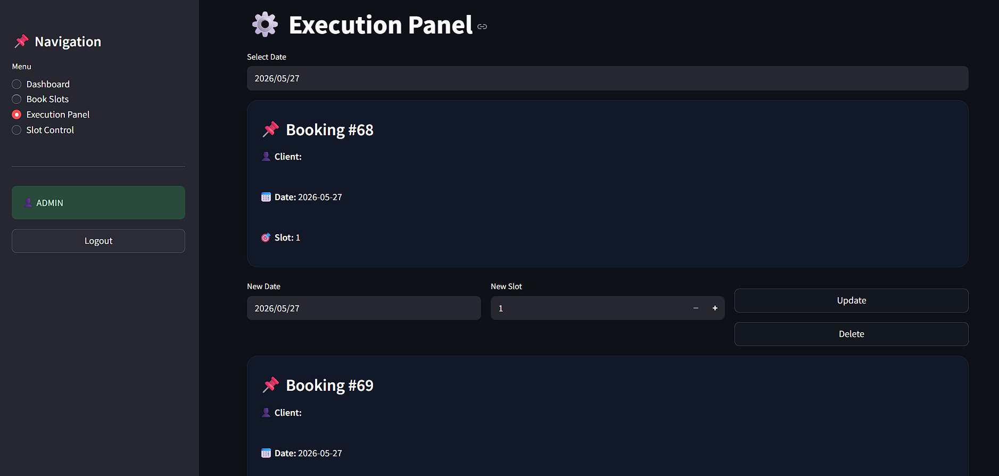
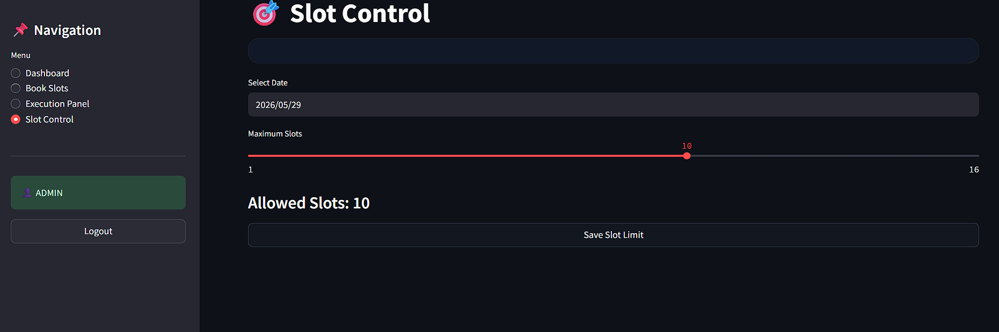

#Slot-Based Capacity Booking System

A real-time multi-user JR Allocation & Capacity Booking System built using Python, MySQL, and Streamlit.

The system enables sales teams to allocate slots dynamically while preventing overbooking through transaction-safe booking logic and role-based operational controls.

#Features

- Real-time slot availability tracking
- Multi-user concurrent booking support
- Role-based access control (Sales / Execution / Admin)
- Capacity management system
- Transaction-safe booking logic
- Dynamic dashboard with utilization tracking
- Execution-level slot reassignment & deletion
- Date-wise operational monitoring

#Tech Stack

- Python
- Streamlit
- MySQL
- Pandas

#Screenshots

# 📸 Screenshots

Login Page

Dashboard

Slot Booking

Execution Panel

Slot Control

#Business Workflow

JR → Slot Allocation → Execution Planning → Slot Management

- Sales team books slots during JR creation
- Execution team can reassign/update slots
- System prevents overbooking using DB constraints
- Capacity controlled dynamically per day

#System Design Highlights

- Database-level concurrency handling
- Unique slot locking mechanism
- Real-time slot validation
- Dynamic slot capacity control
- Modular backend architecture

#Future Improvements

- Google Sheets API integration
- Auto client fetch from JR database
- Email/SMS notifications
- Cloud database deployment
- Analytics dashboard
